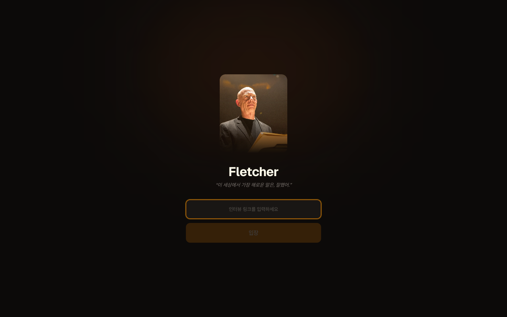
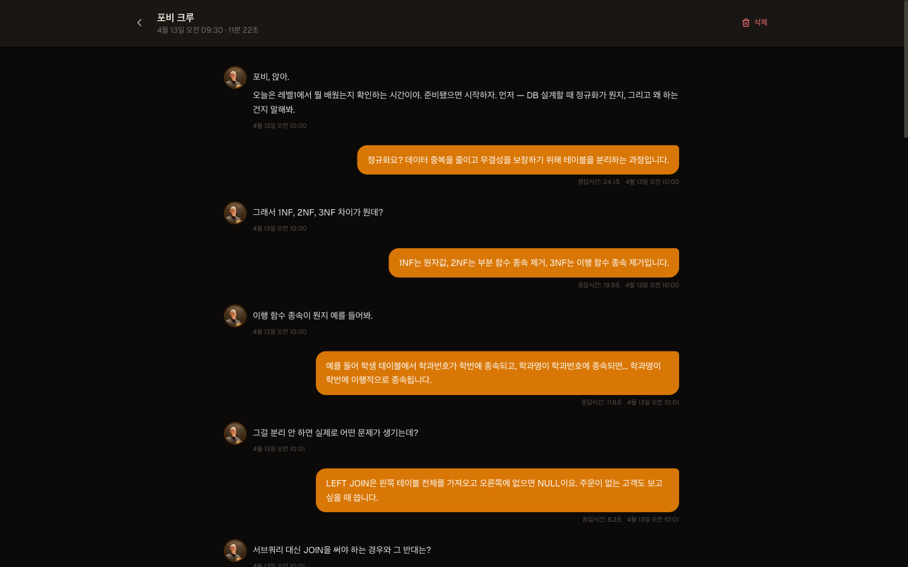
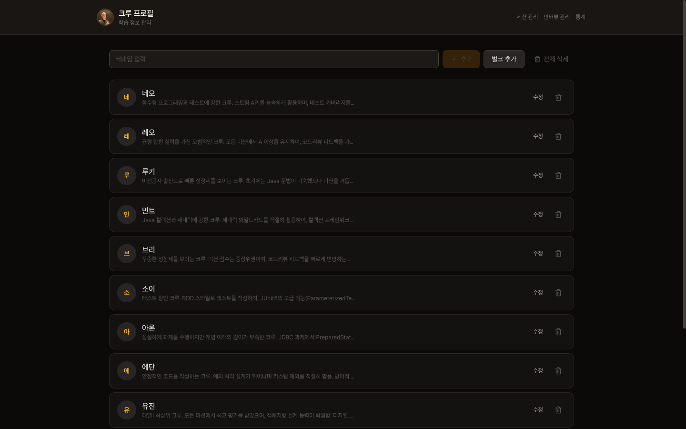
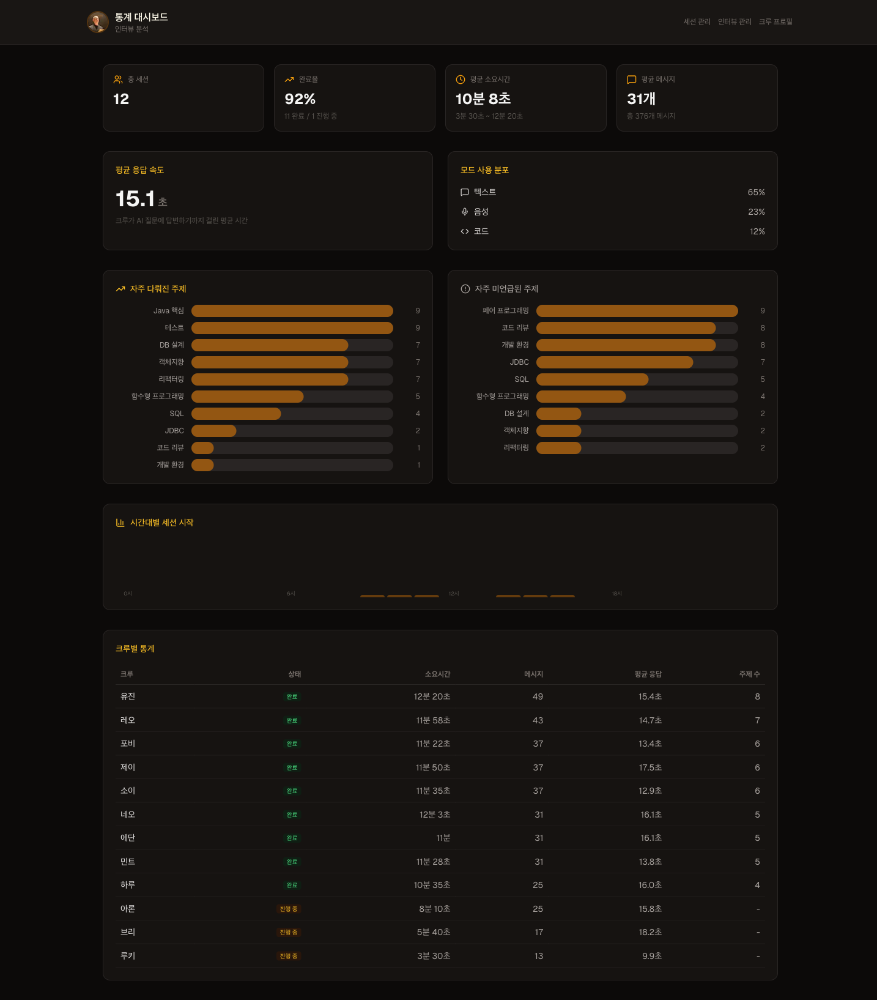

<div align="center">


# Fletcher

**"이 세상에서 가장 해로운 말은, 잘했어."**

소크라테스식 AI 인터뷰어가 학습자의 진짜 이해도를 파헤칩니다.<br/>
텍스트, 음성, 코드 — 세 가지 모드로 대화하고, AI가 실시간으로 평가합니다.

<br/>



<br/>
<br/>

[시작하기](#시작하기) · [주요 기능](#주요-기능) · [어드민](#어드민-대시보드) · [아키텍처](#아키텍처)

</div>

<br/>

## 왜 Fletcher인가?

기존 학습 평가는 **객관식 퀴즈**나 **과제 채점**에 머물러 있습니다. 학습자가 정말로 이해했는지, 아니면 표면적으로 암기했는지 구분하기 어렵습니다.

Fletcher는 다르게 접근합니다:

- **가르치지 않고 질문합니다** — 소크라테스식 대화법으로 학습자 스스로 생각하도록 이끕니다
- **"잘했어" 하지 않습니다** — 모호한 답변에는 끈질기게 파고들어 진짜 이해도를 확인합니다
- **커리큘럼을 가드레일로 사용합니다** — 학습 범위를 벗어나면 자연스럽게 되돌립니다
- **대화가 끝나면 분석합니다** — 다룬 주제, 깊이 있게 탐구한 영역, 놓친 부분을 정리합니다

> 영화 Whiplash의 Fletcher 교수에서 영감을 받았습니다.<br/>
> 냉정하지만, 학습자의 성장을 위한 냉정함입니다.

<br/>

## 주요 기능

### 멀티모달 인터뷰

하나의 세션에서 텍스트, 음성, 코드를 자유롭게 전환하며 대화합니다.

<div align="center">

</div>

| 모드 | 설명 |
|:----:|------|
| **텍스트** | 마크다운 렌더링, 자동 스크롤, Shift+Enter 줄바꿈 |
| **음성** | AWS Transcribe 실시간 STT + Polly 한국어 TTS, Space로 토글 |
| **코드** | Monaco Editor (VS Code 엔진), Java/TypeScript/Python/SQL 지원, 40+ 자동완성 스니펫 |

AI가 대화 중 코드 작성이 필요하다고 판단하면 `[SHOW_CODE]` 신호로 에디터를 자동으로 엽니다.

### AI 인터뷰어

AWS Bedrock (Claude) 기반의 커스터마이징 가능한 AI 면접관입니다.

- **페르소나** — 질문 스타일, 톤, 전략을 인터뷰마다 자유롭게 설정
- **커리큘럼** — 학습 범위를 정의하면 AI가 가드레일로 사용
- **프로필 컨텍스트** — 크루의 학습 이력을 AI에게 전달하여 맞춤형 질문
- **자동 마무리** — 충분한 대화 후 AI가 자연스럽게 인터뷰 종료
- **실시간 스트리밍** — SSE 기반 응답으로 타이핑 효과

### 세션 관리

- **자동 저장** — 모든 메시지가 실시간으로 저장됩니다
- **이어하기** — 중단된 인터뷰를 이전 대화 포함해서 재개
- **시간 제한** — 설정 가능한 타이머 + 분 단위 경고 알림 + 마감 기한
- **데이터 수집** — 응답 시간, 모드 전환, 코드 작성 이벤트까지 기록

### 대화 요약 & 분석

인터뷰가 끝나면 AI가 대화를 분석하여 리포트를 생성합니다:

- **다룬 주제** — 커리큘럼 중 대화에서 언급된 항목
- **깊이 탐구** — 충분히 깊게 다룬 영역
- **더 탐구 가능** — 언급은 했지만 깊이가 부족한 영역
- **미언급** — 전혀 다루지 못한 커리큘럼 항목

<br/>

## 어드민 대시보드

인터뷰 생성, 크루 관리, 세션 열람, 통계까지 — 어드민 키 하나로 모든 것을 관리합니다.

<div align="center">

| 세션 관리 | 세션 상세 |
|:-:|:-:|
|  |  |

| 인터뷰 관리 | 크루 프로필 |
|:-:|:-:|
|  |  |

</div>

### 인터뷰 관리

인터뷰를 생성하고 링크를 배포합니다. 각 인터뷰마다 독립적으로 설정합니다:

- 제목, 슬러그, 설명
- AI 페르소나 (시스템 프롬프트)
- 커리큘럼 (학습 범위)
- 첫 메시지 템플릿 (`{nickname}`, `{curriculum_formatted}` 변수 지원)
- 시간 제한 & 경고 시점
- 마감 기한 (기한 후 자동 차단)
- 활성/비활성 토글

### 크루 프로필

학습자의 배경 정보를 등록하면 AI가 맞춤형으로 질문합니다.

- **개별 등록** — 닉네임 + 학습 데이터 입력
- **벌크 등록** — TXT/CSV/MD/JSON 파일 드래그 앤 드롭
- **AI 요약** — 비정형 텍스트(미션 결과, 코드리뷰 피드백, 코치 노트)를 Claude가 구조화
- **AI 정제** — 벌크 등록 후 채팅으로 프로필 일괄 수정 요청 가능

### 통계 대시보드

<div align="center">

</div>

- 총 세션 수, 완료율, 평균 소요 시간
- 크루별 메시지 수, 응답 속도, 다룬 주제 수 비교
- 모드 사용 비율 (텍스트 vs 음성 vs 코드)
- 가장 많이/적게 다룬 주제 순위
- 시간대별 세션 분포 히스토그램

<br/>

## 사용 흐름

```
코치가 인터뷰 생성          크루가 링크로 접속          코치가 결과 확인
┌─────────────────┐     ┌─────────────────┐     ┌─────────────────┐
│  /admin          │     │  /i/{slug}       │     │  /admin          │
│                  │     │                  │     │                  │
│  페르소나 설정    │ ──→ │  닉네임 입력      │ ──→ │  전체 대화 기록   │
│  커리큘럼 정의    │     │  AI와 대화 시작   │     │  응답 시간 분석   │
│  시간/기한 설정   │     │  텍스트/음성/코드  │     │  주제 커버리지    │
│  링크 복사       │     │  자동 저장        │     │  AI 요약 리포트   │
└─────────────────┘     └─────────────────┘     └─────────────────┘
```

<br/>

## 시작하기

### 필수 조건

- Node.js 20+
- AWS 계정 (Bedrock, Polly, Transcribe 권한)

### 설치 & 실행

```bash
git clone https://github.com/jaeyeonling/fletcher.git
cd fletcher
npm install
cp .env.example .env    # 환경 변수 편집
npm run dev             # http://localhost:3000
```

### 환경 변수

```env
AWS_REGION=ap-northeast-2
AWS_ACCESS_KEY_ID=your-access-key
AWS_SECRET_ACCESS_KEY=your-secret-key
ADMIN_KEY=your-admin-key
```

### AWS IAM 권한

```json
{
  "Version": "2012-10-17",
  "Statement": [
    {
      "Effect": "Allow",
      "Action": [
        "bedrock:InvokeModel",
        "bedrock:InvokeModelWithResponseStream",
        "polly:SynthesizeSpeech",
        "transcribe:StartStreamTranscription"
      ],
      "Resource": "*"
    }
  ]
}
```

### Docker

```bash
docker compose up -d --build
```

<br/>

## 아키텍처

```
Next.js 14 (App Router)
├── /                        랜딩 — 인터뷰 링크 입력
├── /i/{slug}                크루 인터뷰 페이지
├── /admin                   세션 목록 & 상세 열람
├── /admin/interviews        인터뷰 CRUD
├── /admin/profiles          크루 프로필 관리
├── /admin/profiles/bulk     벌크 프로필 등록
├── /admin/stats             통계 대시보드
│
├── /api/ai/chat             AI 대화 (SSE 스트리밍)
├── /api/ai/evaluate         대화 요약 & 분석
├── /api/voice/tts           텍스트 → 음성 (Polly)
├── /api/voice/stt           음성 → 텍스트 (Transcribe)
├── /api/session/*           세션 저장/로드
├── /api/admin/*             어드민 API (인증)
└── /api/health              헬스체크
```

## 기술 스택

| 영역 | 기술 |
|------|------|
| Framework | Next.js 14 (App Router), React, TypeScript |
| Styling | Tailwind CSS |
| AI | AWS Bedrock (Claude Sonnet 4.6), SSE 스트리밍 |
| TTS | Amazon Polly (Neural, 한국어) |
| STT | Amazon Transcribe Streaming (한국어) |
| Code Editor | Monaco Editor (Java 자동완성 포함) |
| Database | SQLite (better-sqlite3) |
| Security | Rate limiting, 경로 주입 방지, 보안 헤더, 어드민 인증 |
| Deploy | Docker Compose, Standalone build |

<br/>

## 라이선스

[MIT](LICENSE)
