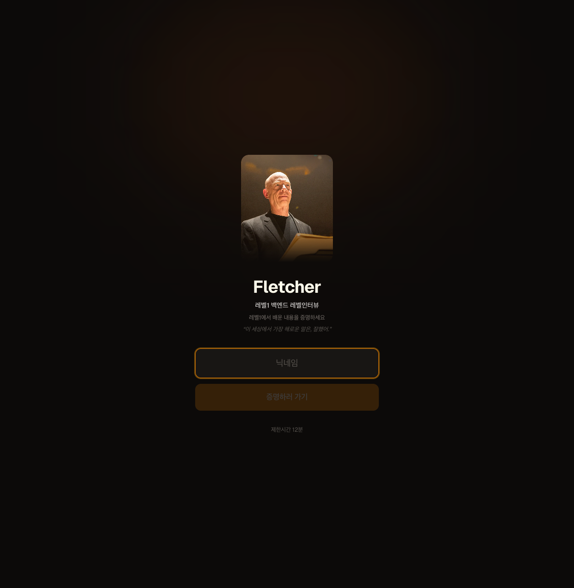
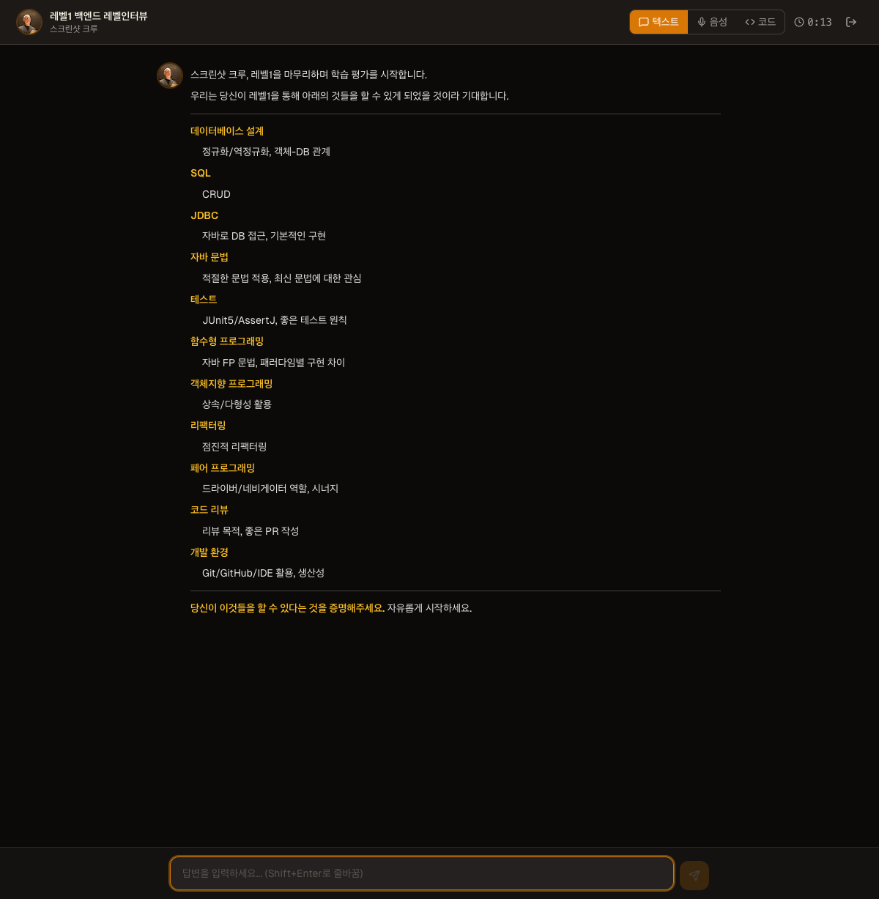
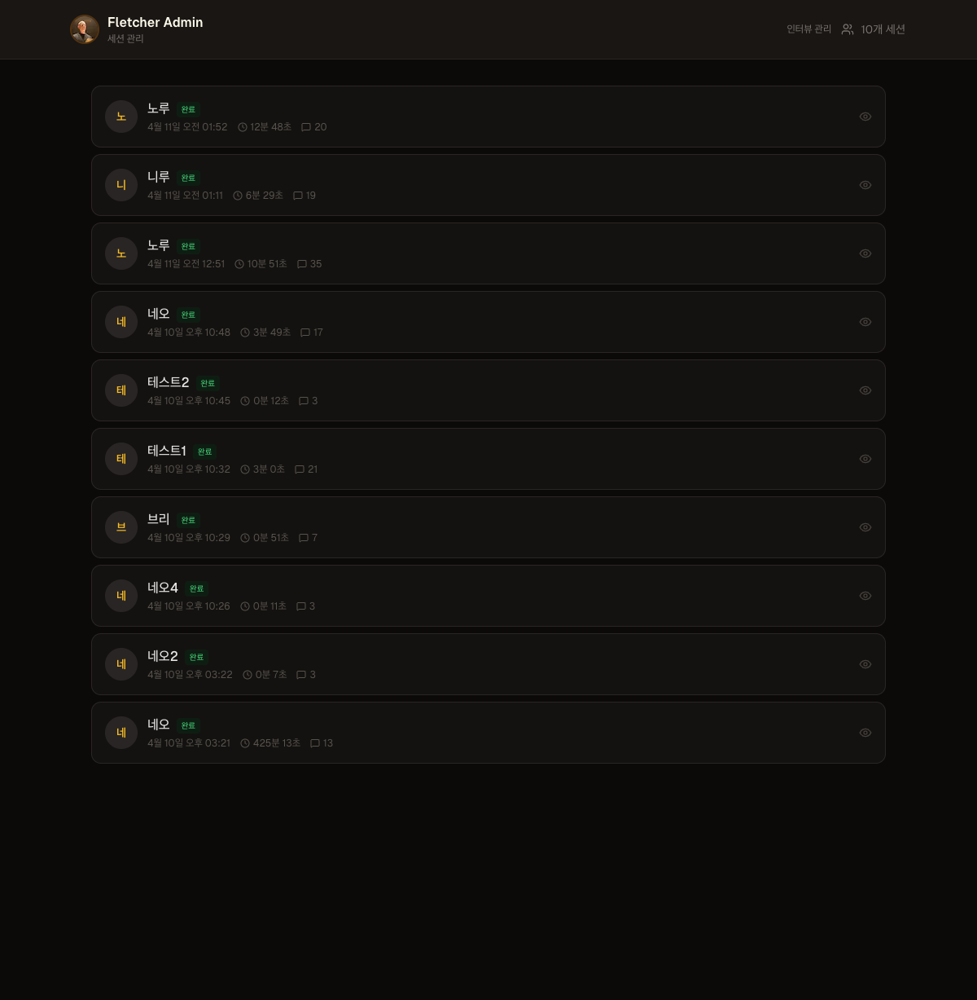
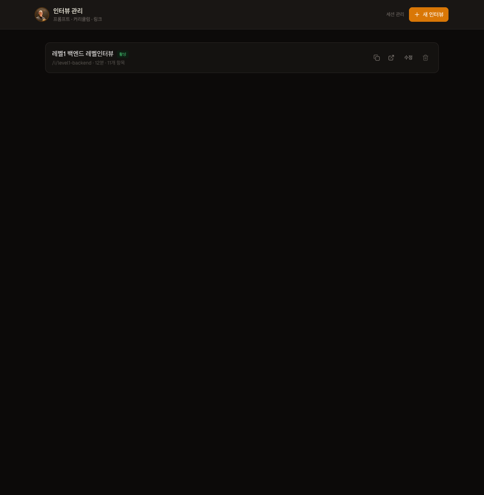

# Fletcher

> "이 세상에서 가장 해로운 말은, 잘했어."

AI 기반 학습 평가 인터뷰 시스템. 소크라테스식 대화법으로 학습자의 이해 깊이를 파악하고, 스스로 생각하도록 이끕니다.

## 스크린샷

| 인터뷰 입장 | 세션 진행 |
|:-:|:-:|
|  |  |

| 어드민 세션 관리 | 인터뷰 관리 |
|:-:|:-:|
|  |  |

## 주요 기능

- **AI 인터뷰어** — AWS Bedrock (Claude) 기반, 커스터마이징 가능한 페르소나
- **텍스트 / 음성 / 코드** — 세 가지 모드로 인터뷰 진행 (Java 자동완성 포함)
- **어드민 대시보드** — 인터뷰 생성, 프롬프트 관리, 세션 열람, 통계
- **크루 프로필** — 개별/벌크 등록, LLM 요약, JSON 파일 자동 파싱
- **통계 대시보드** — 완료율, 응답 속도, 주제 분포, 크루별 비교
- **시간 제한** — 설정 가능한 제한시간 + 경고 알림 + 마감 기한
- **세션 자동 저장** — 대화마다 자동 저장, 세션 이어하기 지원
- **데이터 수집** — 대화 기록, 응답 시간, 모드 전환, 코드 작성 이벤트 기록
- **보안** — Rate limiting, 경로 주입 방지, 보안 헤더, 어드민 인증
- **접근성** — ARIA 속성, 키보드 네비게이션 (Space로 음성 토글)
- **에러 처리** — React Error Boundary, 전송 실패 시 재전송 버튼

## 아키텍처

```
Next.js 14 (App Router)
├── /                        링크 입력 (랜딩)
├── /i/{slug}                크루 인터뷰 페이지
├── /admin                   세션 관리
├── /admin/interviews        인터뷰 생성/관리
├── /admin/profiles          크루 프로필 관리
├── /admin/profiles/bulk     벌크 프로필 추가
├── /admin/stats             통계 대시보드
├── /api/ai/chat             AI 대화 (SSE 스트리밍)
├── /api/ai/evaluate         대화 요약
├── /api/voice/tts           텍스트→음성 (Amazon Polly)
├── /api/voice/stt           음성→텍스트 (Amazon Transcribe)
├── /api/interview           인터뷰 설정 조회 (public)
├── /api/profile/check       프로필 존재 확인 (public)
├── /api/session/*           세션 저장/로드
├── /api/admin/*             어드민 API (인증 필요)
└── /api/health              헬스체크
```

## 시작하기

### 필수 조건

- Node.js 20+
- AWS 계정 (Bedrock, Polly, Transcribe 권한)

### 설치

```bash
git clone https://github.com/jaeyeonling/fletcher.git
cd fletcher
npm install
```

### 환경 설정

```bash
cp .env.example .env
```

`.env` 파일을 편집합니다:

```env
AWS_REGION=ap-northeast-2
AWS_ACCESS_KEY_ID=your-access-key
AWS_SECRET_ACCESS_KEY=your-secret-key
ADMIN_KEY=your-admin-key
```

### AWS IAM 권한

사용하는 IAM 사용자/역할에 다음 권한이 필요합니다:

```json
{
  "Version": "2012-10-17",
  "Statement": [
    {
      "Effect": "Allow",
      "Action": [
        "bedrock:InvokeModel",
        "bedrock:InvokeModelWithResponseStream",
        "polly:SynthesizeSpeech",
        "transcribe:StartStreamTranscription"
      ],
      "Resource": "*"
    }
  ]
}
```

### 실행

```bash
npm run dev
```

http://localhost:3000 으로 접속합니다.

## 사용법

### 1. 인터뷰 만들기

1. `/admin/interviews` 접속 (Admin Key 필요)
2. "새 인터뷰" 클릭
3. 제목, 슬러그, 페르소나, 커리큘럼, 첫 메시지 설정
4. 저장 → 링크 복사

### 2. 인터뷰 진행

1. 크루에게 `/i/{slug}` 링크 전달
2. 크루가 닉네임 입력 → 인터뷰 시작
3. 텍스트/음성/코드 모드로 대화
4. 시간 종료 시 자동 마무리 + 대화 요약

### 3. 크루 프로필 등록 (선택)

1. `/admin/profiles` 접속
2. 개별 추가 또는 "벌크 추가"로 JSON 파일 업로드
3. 등록된 크루는 인터뷰 시 AI가 학습 배경을 참고

### 4. 결과 확인

1. `/admin` — 세션 목록에서 크루 선택 → 전체 대화 기록 + 응답 시간 + 요약
2. `/admin/stats` — 완료율, 응답 속도, 주제 분포, 크루별 비교

## 커스터마이징

### 페르소나

어드민에서 AI의 성격, 질문 전략, 톤을 자유롭게 설정할 수 있습니다.

### 커리큘럼

학습 범위를 정의하면 AI가 대화 가드레일로 사용합니다. 범위 밖 주제로 벗어나면 되돌립니다.

### 메시지

시간 경고, 종료 안내 등 모든 시스템 메시지를 인터뷰별로 커스터마이징할 수 있습니다.

## 배포

### Docker

```bash
docker compose up -d --build
```

### 직접 실행

```bash
npm run build
node .next/standalone/server.js
```

## 데이터 저장

세션 데이터는 `data/sessions/{닉네임}/{sessionId}.json`에 저장됩니다.

```json
{
  "sessionId": "2026-04-11-abc123",
  "interviewId": "interview-id",
  "nickname": "크루이름",
  "startedAt": "2026-04-11T06:21:36.798Z",
  "durationSeconds": 3600,
  "messages": [
    {
      "role": "user",
      "content": "...",
      "timestamp": "...",
      "responseTimeMs": 5200,
      "mode": "voice"
    }
  ],
  "events": [
    {
      "type": "mode_change",
      "timestamp": "...",
      "data": { "from": "chat", "to": "voice" }
    }
  ],
  "summary": { }
}
```

## 기술 스택

| 영역 | 기술 |
|------|------|
| Frontend | Next.js 14, React, TypeScript, Tailwind CSS |
| AI | AWS Bedrock (Claude Sonnet 4.6) |
| TTS | Amazon Polly |
| STT | Amazon Transcribe Streaming |
| Code Editor | Monaco Editor |
| Storage | 로컬 파일시스템 (JSON) |

## 라이선스

[MIT](LICENSE)
